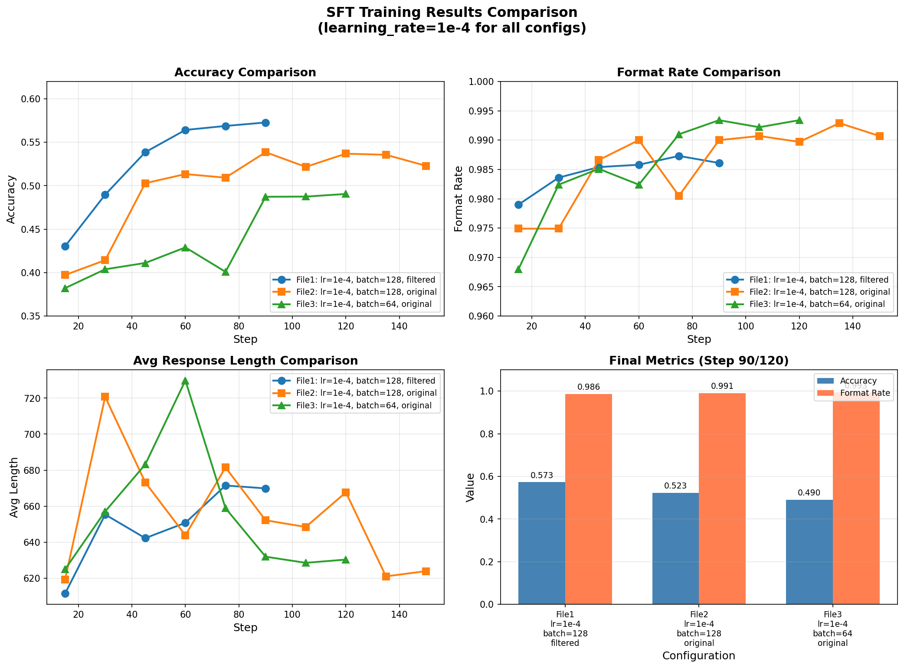
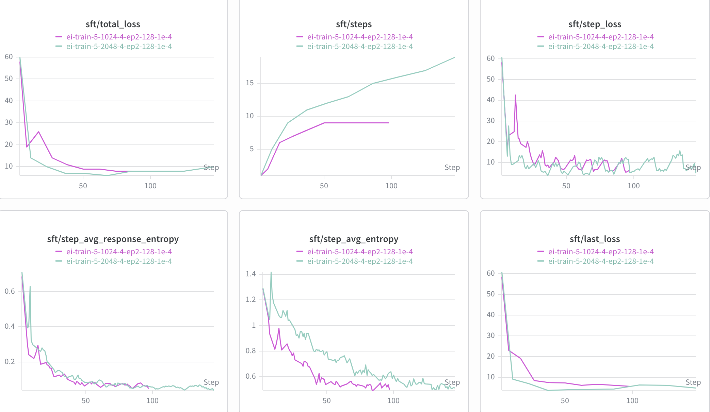
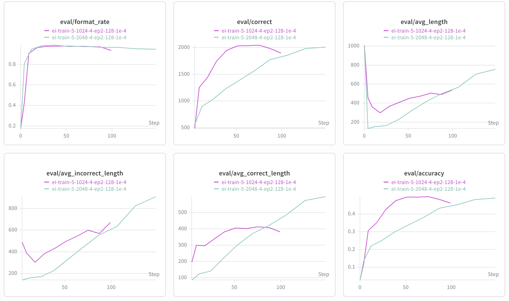

# CS336 Spring 2025 Assignment 5: Alignment

本项目实现了多种对齐算法，包括 SFT (Supervised Fine-Tuning)、GRPO (Group Relative Policy Optimization)、DPO (Direct Preference Optimization) 等。

## 实验结果汇总

### 1. SFT (Supervised Fine-Tuning)



- 使用correct的filter数据，性能明显提升
---

### 2. EI (Ensemble Initialization)





- rollout_batch_size是2048的时候，收敛慢，1024收敛快。
- entropy随着收敛逐渐降低
---

### 3. GRPO (Group Relative Policy Optimization)

#### 3.1 学习率 (LR) 对比


- LR=3e-05 最优，最终准确率稳定在较高水平 (avg_final=0.6210)
- LR=4e-05 最高准确率也很高(0.7031)，但最终准确率下降至0.2192，也可以使用
- LR=2e-05 稳定，但是性能不行

#### 3.2 Baseline对比


- reinforce_with_baseline 显著优于 no_baseline
- no_baseline 准确率下降约60%

#### 3.3 Norm Type 对比


- 三种norm_type性能相近
- constant 和 normalize 略优
- norm=none 表现较差

#### 3.4 use_std_normalization 对比


- use_std_normalization=True 和 False 差异不大

#### 3.5 GRPO_CLIP Epoch/BatchSize 对比


- 波动较大，会有突然的波动影响结果

---

### 4. Instruct SFT + DPO

#### 4.1 SFT Training Metrics


#### 4.2 DPO Training Metrics


#### 4.3 Zero-Shot Evaluation Results

| 文件名 | GSM8K | MMLU | AlpacaEval Len | Safety Reward | Safe Rate |
|--------|-------|------|----------------|---------------|-----------|
| zeroshot_eval_results | 6.52% | 54.55% | 1998.02 | 0.285 | 34% |
| zeroshot_eval_results_sft | 1.13% | 45.4% | 1063.31 | 0.455 | 89% |
| zeroshot_eval_results_dpo | 0.83% | 45.4% | 1059.88 | 0.471 | 91% |

---

## Setup

As in previous assignments, we use `uv` to manage dependencies.

1. Install all packages except `flash-attn`, then all packages (`flash-attn` is weird)
```
uv sync --no-install-package flash-attn
uv sync
```

2. Run unit tests:

``` sh
uv run pytest
```

Initially, all tests should fail with `NotImplementedError`s.
To connect your implementation to the tests, complete the
functions in [./tests/adapters.py](./tests/adapters.py).
