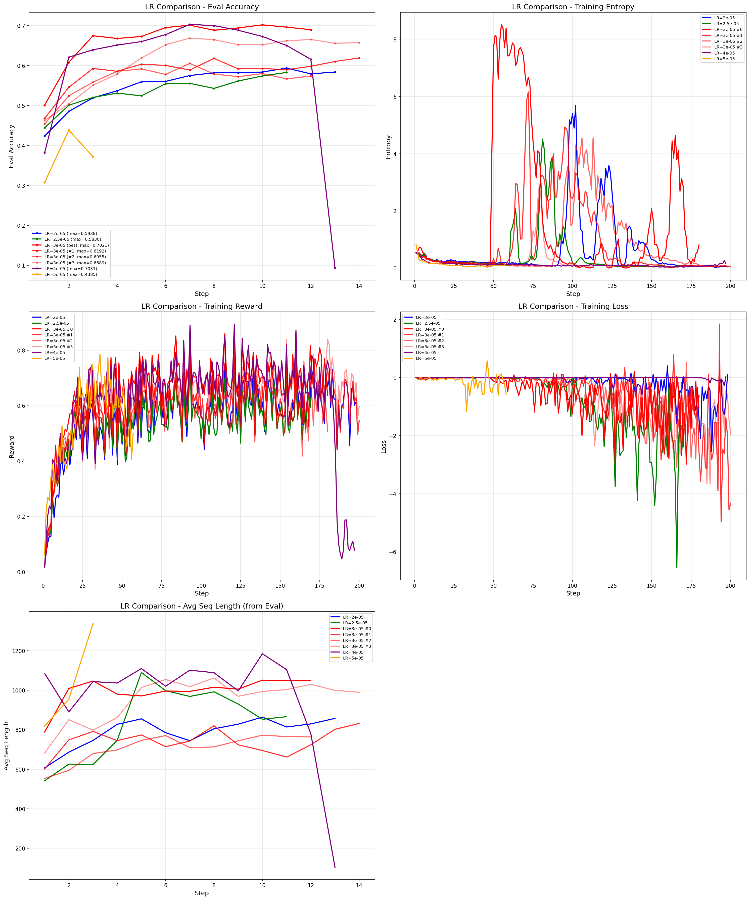
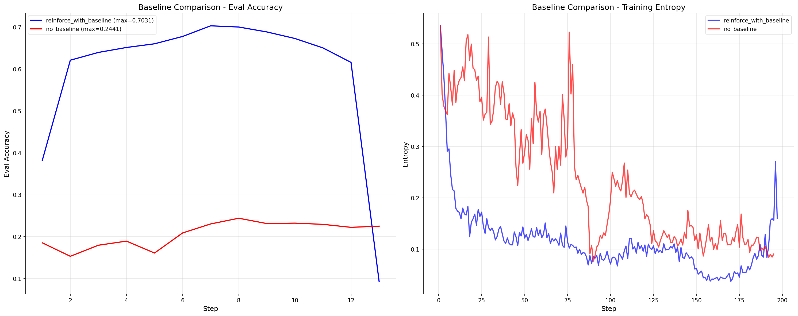
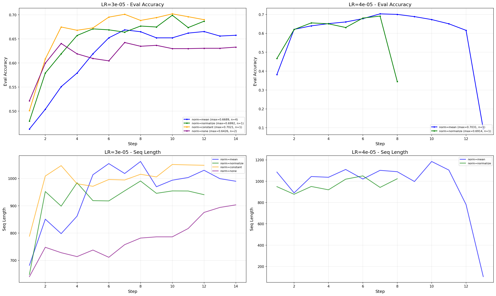
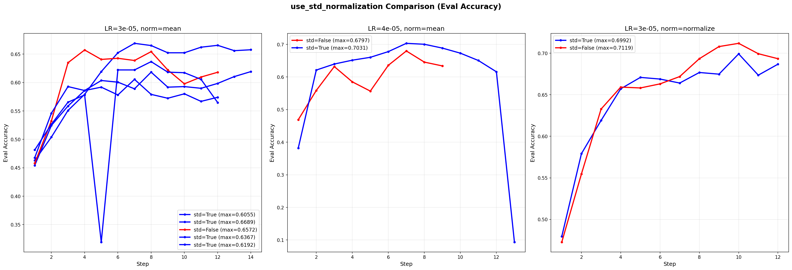
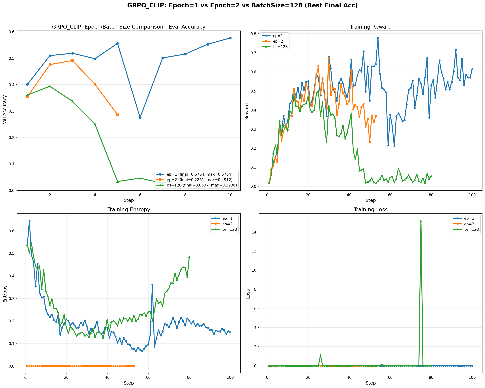

# GRPO 消融实验报告 V2

## 1. LR对比 (std=true, reinforce_with_baseline)

- LR=3e-5 最优，最终准确率稳定在较高水平 (avg_final=0.6210)
- LR=4e-5 最高准确率也很高(0.7031)，但最终准确率下降至0.2192，也可以使用
- LR=2e-5 稳定，但是性能不行
- entropy波动好大

---

## 2. Baseline对比 (reinforce_with_baseline vs no_baseline)

- reinforce_with_baseline 显著优于 no_baseline
- no_baseline 准确率下降约60%

---

## 3. Norm Type对比 (std=true, reinforce_with_baseline)

| Norm Type | 实验数量 | avg_max | max |
|-----------|---------|---------|-----|
| mean | 5 | ~0.65 | 0.7031 |
| normalize | 2 | ~0.70 | 0.6992 |
| constant | 1 | 0.7021 | 0.7021 |
| none | 2 | 0.61 | 0.6426 |

- 相差不是很大，constant看起来略优，有点类似直接求和了 
- norm=none，，这个是/所有token数，但是因为microbatch(=2)的问题，会有点和mean近似
- norm=mean做了实验比较多，在飞书lark中，会有incorrect_seq_len太大情况，因为长文本loss权重降低，长度膨胀

## 4. use_std_normalization对比 (loss=reinforce_with_baseline)

- use_std_normalization=True 和 False 差异不是很大
- std=False 略优

---

## 5. Grpo_Clip对比 (loss_type=grpo_clip)

- 波动好大，会有突然的波动影响结果
