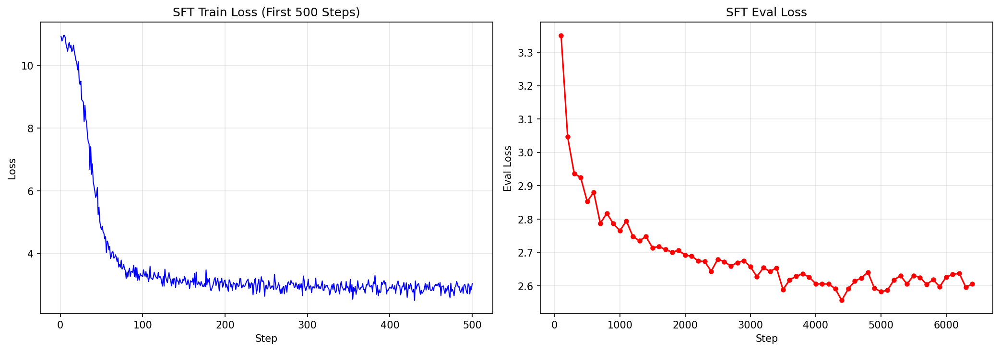
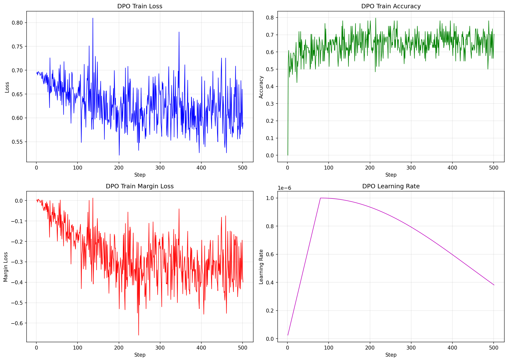
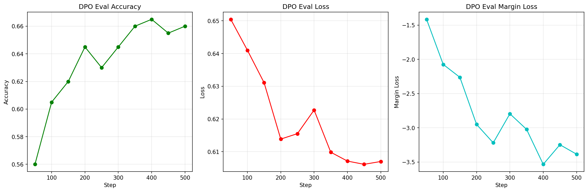

# SFT & DPO Training Analysis Report

## 1. SFT Training Metrics

### SFT All Metrics Combined

## 2. DPO Training Metrics

### DPO Train All Metrics Combined

### DPO Eval All Metrics Combined

## 2. Zero-Shot Evaluation Results
简单抽样评估了一下

| 文件名 | GSM8K | MMLU | AlpacaEval Len | Safety Reward | Safe Rate |
|--------|-------|------|----------------|---------------|-----------|
| zeroshot_eval_results | 6.52% | 54.55% | 1998.02 | 0.285 | 34% |
| zeroshot_eval_results_sft | 1.13% | 45.4% | 1063.31 | 0.455 | 89% |
| zeroshot_eval_results_dpo | 0.83% | 45.4% | 1059.88 | 0.471 | 91% |
